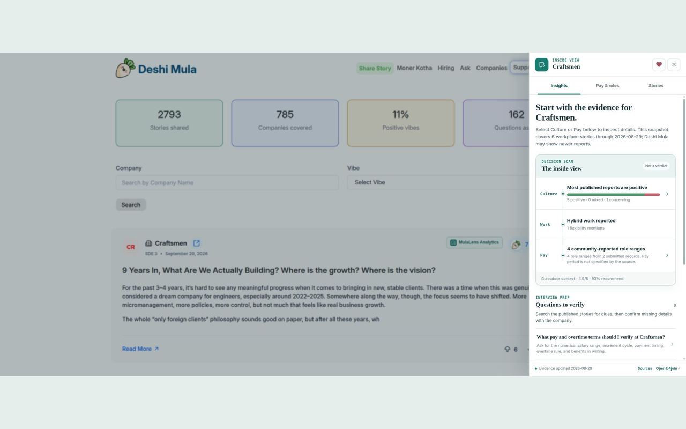

# MulaLens

MulaLens is a Chrome extension for researching companies while browsing [Deshi Mula](https://deshimula.com/), [Beton Kemon](https://www.betonkemon.com/), and [TruCareer](https://trucareer.co/). It places workplace stories, reported pay, jobs, source links, and cited answers beside supported company listings and profiles.

**[Install from the Chrome Web Store](https://chromewebstore.google.com/detail/mulalens/fchnnoakpkkefkpbcliooalddncffedo) · [Report an issue](https://github.com/montasim/MulaLens/issues) · [Read the privacy policy](PRIVACY.md)**



## Start researching

1. Install MulaLens from the Chrome Web Store in Chrome.
2. Open the toolbar popup. It will guide you to a supported company site; on a supported company profile, it can open that company's research directly.
3. Find a company and select **MulaLens Analytics** beside its name. The research panel opens on the page with the available insights.
4. Explore **Insights**, **Pay & roles**, and **Stories**. Open source links for context. **Ask the evidence** lets you submit a focused question and read a cited answer after accepting its storage disclosure.

On Beton Kemon and TruCareer, a button appears only when MulaLens verifies a matching company record in the b4join research API. Some listed companies will therefore have no button. If you installed or updated the extension while a company page was open, reload that tab.

The Chrome Web Store listing may have an older published version while the 3.1.0 update is under review. The source and local build instructions below describe this repository's current 3.1.0 code.

## What it shows

- A company brief with workplace signals and linked sources.
- Community workplace stories and search by role, topic, or phrase.
- Reported salary evidence, roles, and job links where available.
- Answers grounded in available stories and comments, with citations.

These are research inputs, not verified company policy. Community reports may be incomplete or outdated, and generated answers may be wrong. Check original sources and confirm consequential claims independently.

## Build and use locally

You need Chrome, Node.js **20.19.3 or newer**, and **pnpm 10.10.0**. No account, local backend, environment variables, or API key is required for the extension; research features depend on the hosted b4join API being available.

```sh
git clone https://github.com/montasim/MulaLens.git
cd MulaLens
pnpm install --frozen-lockfile
pnpm build:extension
```

Open `chrome://extensions` in Chrome, enable **Developer mode**, select **Load unpacked**, and choose `dist/extension/` (the directory containing `manifest.json`). Then open or reload a supported company page and select **MulaLens Analytics** beside a company with available research. The in-page panel is the success signal.

For a packaged manual install, the [GitHub release](https://github.com/montasim/MulaLens/releases/latest) provides an unpacked extension ZIP and checksum when a release has been published. Extract the ZIP before using **Load unpacked**; keep the extracted directory in place while the extension is installed.

## How it works

The content script finds company entries on the three supported sites and adds the button and research panel. Deshi Mula company links provide the research identifier. Beton Kemon identifiers are checked against the API, with explicit mappings for known differences. TruCareer uses the visible company name to form a candidate identifier and checks the returned company name before showing a button. A site's own listing does not guarantee that b4join has research for that company.

The extension's background service worker sends research requests to `https://b4joinacompany.netlify.app/api/v1/extension`. The backend owns the company data, story search, jobs, salary evidence, answers, and quotas. The extension contains neither an offline research dataset nor a backend API key. See [architecture](docs/ARCHITECTURE.md) for the component boundary.

## Permissions and privacy

The Manifest V3 extension runs content scripts only on `deshimula.com`, `betonkemon.com`, and `trucareer.co` (including supported `www` variants). Its API host permission covers `b4joinacompany.netlify.app`. The `activeTab` permission lets the toolbar popup inspect the current tab when clicked; `storage` remembers the user's Ask disclosure choice.

The extension sends company identifiers for research requests. It sends story-search terms or Ask questions when you use those features. It does not request an account or collect browsing history. The Ask form explains the stated retention terms before the first submission, and the popup can reset that saved choice. See the [privacy policy](PRIVACY.md) for data handling and deletion requests.

## Workspace and checks

| Path | Purpose |
| --- | --- |
| `apps/extension/` | Browser UI, content script, API bridge, build, and tests |
| `apps/web/` | Product website built with TanStack Start and React |
| `docs/` | Architecture, decisions, site research, and Store submission guidance |
| `store-assets/v3.1.0/` | Captured screenshots and promotional media |

```sh
pnpm check             # Check, test, and build both apps
pnpm check:extension   # Check and build only the extension
pnpm check:web         # Check and build only the website
pnpm dev:web           # Start the website at http://localhost:3000
```

The website is a separate workspace app. Its current copy still focuses on Deshi Mula, while this extension source supports three sites. `pnpm build:web` produces its Netlify deployment output; the extension build writes `dist/extension/` directly. Version tags matching `v*` trigger the [release workflow](.github/workflows/release.yml), which checks the workspace and packages the extension with a SHA-256 checksum. [Store submission guidance](docs/CHROME_WEB_STORE.md) describes the separate Chrome Web Store update process.

## Help and participation

Use [GitHub Issues](https://github.com/montasim/MulaLens/issues) for reproducible bugs and focused feature requests. Include the supported site, page type, expected behavior, and what happened. Do not post private questions or sensitive workplace details in public issues. Focused pull requests are welcome; run `pnpm check` and include a screenshot for visible UI changes.

For a vulnerability or a private data request, use the contact and reporting instructions in the [privacy policy](PRIVACY.md). Voluntary support is listed in the repository's [funding metadata](.github/FUNDING.yml).

## License

This repository has no license file. Public source access does not grant permission to copy, modify, or redistribute its code.
